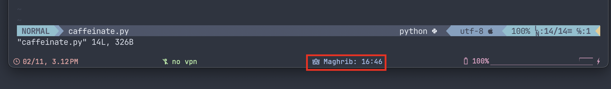
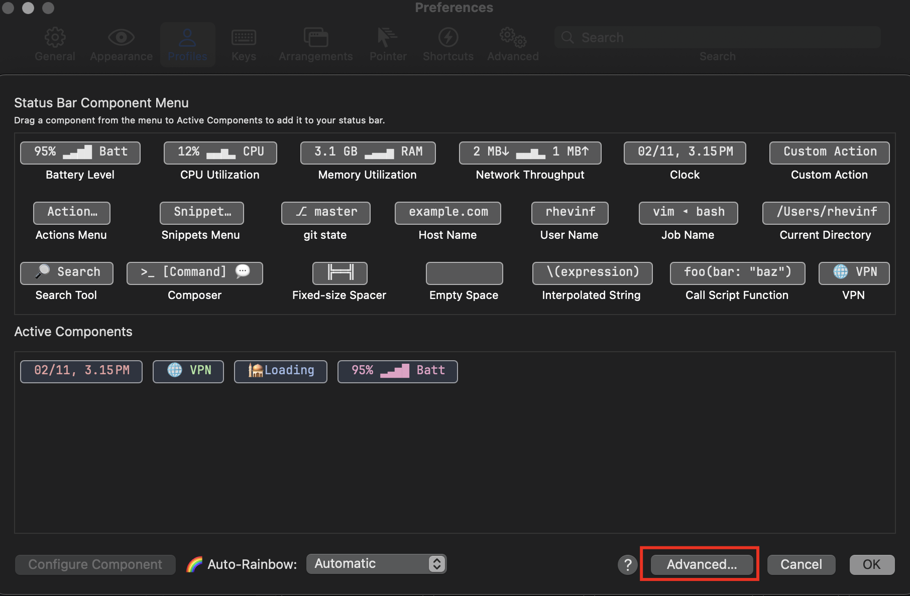
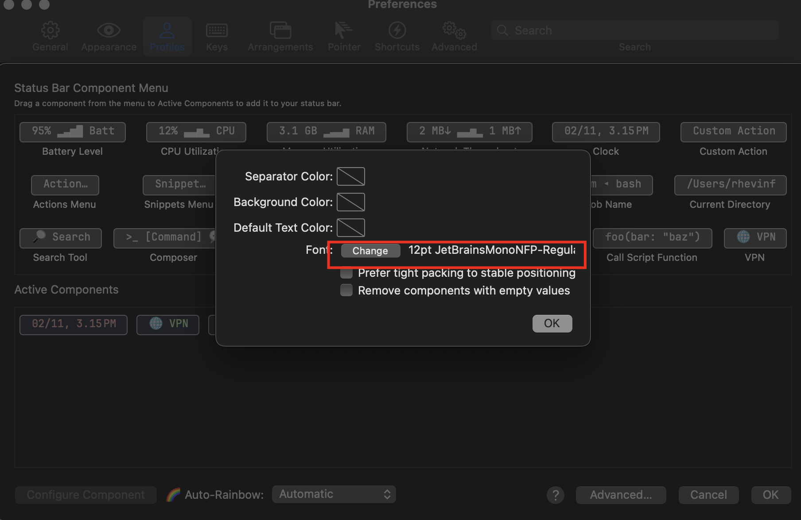

# iterm2-statusbar-prayer-times
iterm2 statusbar prayer times

# Table of Contents
<!-- @import "[TOC]" {cmd="toc" depthFrom=2 depthTo=6 orderedList=false} -->

<!-- code_chunk_output -->

- [Prerequisites](#prerequisites)
- [Installation](#installation)
- [Configuration](#configuration)

<!-- /code_chunk_output -->

## Prerequisites

The components use glyphs from a patched NERDfont. So you need to install a NERDfont and set it as the default font for status bar components.

I use the Source Code Pro patched NERDfont, this and other NERDfonts can be found in [Nerd Font](https://www.nerdfonts.com/). The status bar font of iTerm2 can be setted in `iTerm Preferences->Profile->Session->Configure Status Bar->Advanced`.

## Installation

1. `git clone https://github.com/Rhevin/iterm2-statusbar-prayer-times && cd iterm2-statusbar-prayer-times`
1. Install script to iTerm2 by using `./install.sh`. Or copy the scripts you want to `~/Library/Application Support/iTerm2/Scripts/AutoLaunch`
1. Click **Scripts > AutoLaunch** in the iTerm2 menu bar and select the components you want to be available.
1. Open `iTerm Preferences->Profile->Session->Configure Status Bar` and drag the components where you like.

You may need to restart the iTerm after installing the new components to make the scripts loaded.

## Configuration
* Location can be changed on this variable
`PRAYER_TIMES_PARAMS = {"country": "LT", "zipcode": "01001", "time_format": "0"}`
example for Vilnius Lithuania
references
https://www.islamicfinder.us/index.php/api

* The `update interval` can be set by changing `update_cadence`. The unit is second.

## Credits
Inspired by https://github.com/Vxider/iterm-components/
